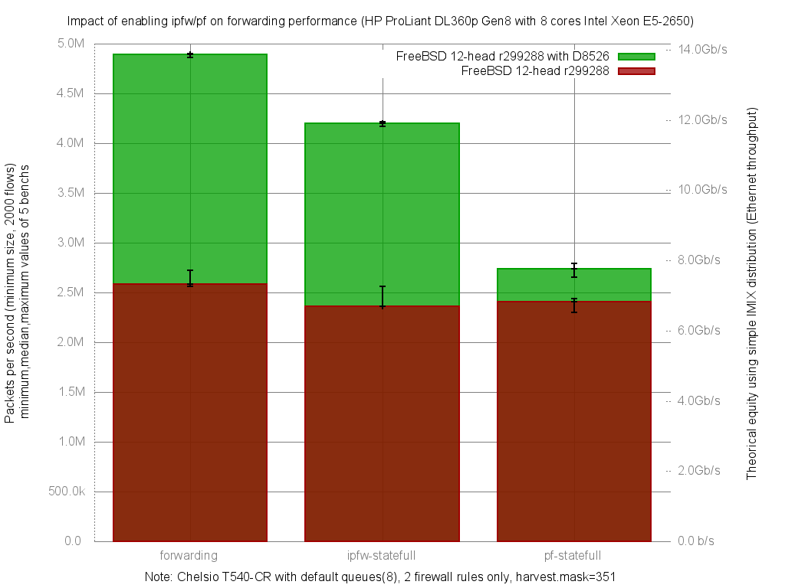

Impact of enabling ipfw or pf on forwarding performance
  - HP ProLiant DL360p Gen8 with height cores (Intel Xeon E5-2650 @ 2.60GHz)
  - Quad port Chelsio 10-Gigabit T540-CR and OPT SFP (SFP-10G-LR)
  - FreeBSD 12-head r299288 with D8526
  - 2000 flows of smallest UDP packets
  - 2 firewall rules, 2 static routes
  - ntxq10g and nrxq10g = number of core (default) = 8
  - Traffic load at 10Mpps
  - harvest.mask=351
  - [lab details] (http://bsdrp.net/documentation/examples/forwarding_performance_lab_of_a_hp_proliant_dl360p_gen8_with_10-gigabit_with_10-gigabit_chelsio_t540-cr)




forwarding ministat:

```
x 299288.forwarding.pps
+ 299288D8526.forwarding.pps
+--------------------------------------------------------------------------+
|                                                                         +|
|                                                                         +|
| xx                                                                      +|
| xx   x                                                                 ++|
||_A_|                                                                     |
|                                                                        AM|
+--------------------------------------------------------------------------+
    N           Min           Max        Median           Avg        Stddev
x   5     2557918.5       2726647       2582839     2604092.6     70145.717
+   5     4859469.5     4900864.5     4894786.5     4889263.5     16916.586
Difference at 95.0% confidence
        2.28517e+06 +/- 74413.4
        87.7531% +/- 2.85756%
        (Student's t, pooled s = 51022.5)

```

ipfw ministat:

```
x 299288.ipfw-statefull.pps
+ 299288D8526.ipfw-statefull.pps
+--------------------------------------------------------------------------+
|  x                                                                     ++|
|  x      x                                                             +++|
||_MA___|                                                                  |
|                                                                        A||
+--------------------------------------------------------------------------+
    N           Min           Max        Median           Avg        Stddev
x   5     2358275.5     2561653.5       2363857     2404877.1     87984.791
+   5     4172399.5       4218408       4196955     4200136.8     18895.161
Difference at 95.0% confidence
        1.79526e+06 +/- 92805.3
        74.6508% +/- 3.85904%
        (Student's t, pooled s = 63633.1)

```

pf ministat:

```
x 299288.pf-statefull.pps
+ 299288D8526.pf-statefull.pps
+--------------------------------------------------------------------------+
|x x             x    x                              +        +   + +     +|
|  |_________A___M_____|                                                   |
|                                                        |_______AM_____|  |
+--------------------------------------------------------------------------+
    N           Min           Max        Median           Avg        Stddev
x   5     2298524.5       2441315     2408092.5     2379540.1     70111.703
+   5       2654797       2795614       2739809     2732798.7     52276.777
Difference at 95.0% confidence
        353259 +/- 90190.9
        14.8457% +/- 3.79027%
        (Student's t, pooled s = 61840.6)
```
