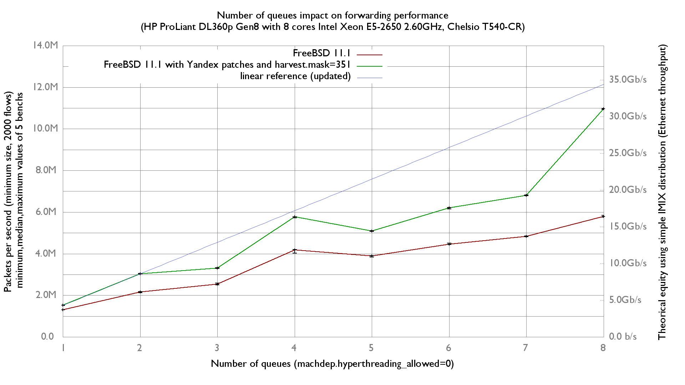

Impact of yandex's patchs and random.harvest.mask on forwarding performance
  - HP ProLiant DL360p Gen8 with eight cores (Intel Xeon E5-2650 @ 2.60GHz)
  - Quad port Chelsio 10-Gigabit T540-CR and OPT SFP (SFP-10G-LR)
  - FreeBSD 11.1 patched
  - 2000 flows of smallest UDP packets
  - 2 static routes
  - ntxq10g and nrxq10g = 1, 2, 3, 4, 5, 6, 7 and 8 (=number of core=default on this setup)
  - Traffic load at 14 Mpps
  - random.harvest.mask=351



```
x FreeBSD 11.1-RELEASE: inet4 packet-per-second
+ FreeBSD 11.1 with Yandex's patch and random.harvest.mask=351: inet4 pps
+--------------------------------------------------------------------------+
| x                                                                       +|
| x                                                                       +|
|xx                                                                       +|
|xxx                                                                     ++|
||A                                                                        |
|                                                                         A|
+--------------------------------------------------------------------------+
    N           Min           Max        Median           Avg        Stddev
x  10       5687952       5807227     5753657.2     5751881.1     37807.491
+   5      10939773      10978195      10962195      10961127     13820.173
Difference at 95.0% confidence
        5.20925e+06 +/- 38306.2
        90.566% +/- 1.24308%
        (Student's t, pooled s = 32378.3)
```
