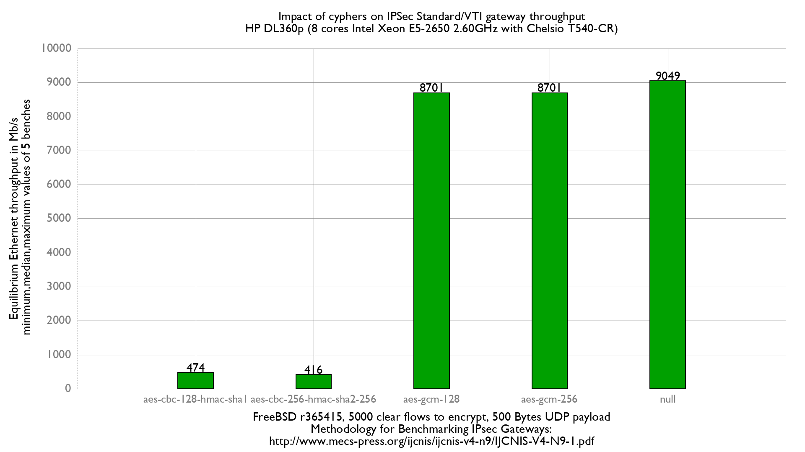

Impact of cyphers on IPsec VTI performance
  - HP ProLiant DL360p Gen8 with 8 cores (Intel Xeon E5-2650 @ 2.60GHz)
  - Quad port Chelsio 10-Gigabit T540-CR and OPT SFP (SFP-10G-LR).
  - FreeBSD 13-head r365873
  - if_ipsec (VTI) mode
  - 5000 flows of clear UDP packets
  - dev.igb.*.iflib.tx_abdicate=1
  - 500Bytes UDP load => packet size: 528B => Ethernet frame size:542B



Difference standard vs VTI:
```
x null cypher, standard mode: Mb/s
+ null cypher, VTI mode: Mb/s
+--------------------------------------------------------------------------+
|                                                                         +|
|                                                                         +|
|                                                                         +|
| x                                                                       +|
|xxxx                                                                     +|
||A|                                                                       |
|                                                                         A|
+--------------------------------------------------------------------------+
    N           Min           Max        Median           Avg        Stddev
x   5          7787          7838          7809        7811.6     18.433665
+   5          9049          9049          9049          9049             0
Difference at 95.0% confidence
	1237.4 +/- 19.0102
	15.8405% +/- 0.281907%
	(Student's t, pooled s = 13.0346)
```
