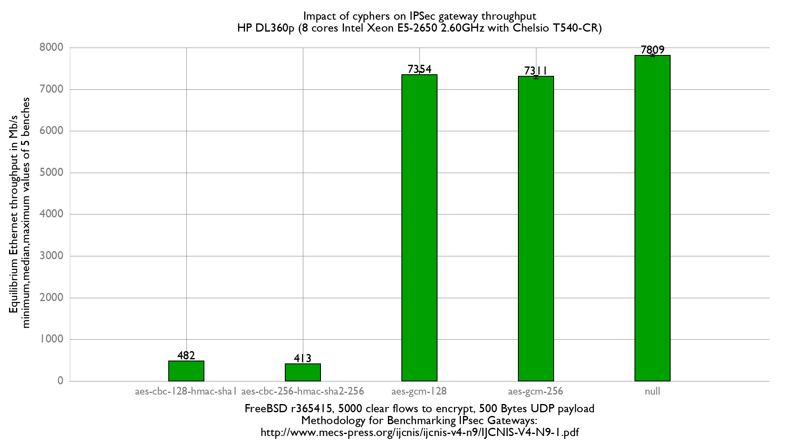

Impact of cyphers on IPsec performance
  - HP ProLiant DL360p Gen8 with 8 cores (Intel Xeon E5-2650 @ 2.60GHz)
  - Quad port Chelsio 10-Gigabit T540-CR and OPT SFP (SFP-10G-LR).
  - FreeBSD 13-head r365873
  - 4 SAD/SPD (2 IPv4, 2 IPv6)
  - 5000 flows of clear UDP packets
  - dev.igb.*.iflib.tx_abdicate=1
  - 500Bytes UDP load => packet size: 528B => Ethernet frame size:542B

[FlameGraph with null cypher](flamegraph.svg)
