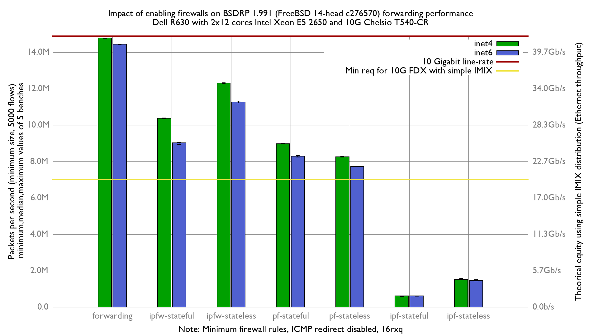

Impact of enabling firewalls on BSDRP 1.991 forwarding performance
  - Dell PowerEdge R630 with 2 Intel E5-2650 v4 2.2Ghz (2x12 cores)
  - Chelsio T520-CR
  - FreeBSD 14-head c276570
  - Minimum firewall rules
  - ICMP redirect disabled
  - 16 rxq

