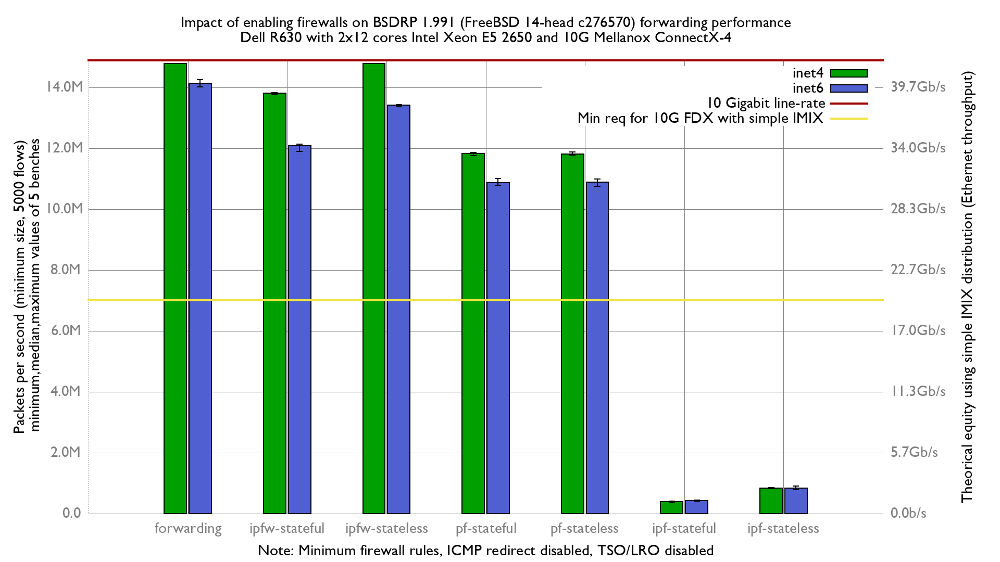

# Impact of enabling firewalls on BSDRP 1.991 (FreeBSD 12-stable r354440) forwarding performance
Lab:
  - Dell PowerEdge R630 with 2 Intel E5-2650 v4 2.2Ghz (2x12 cores)
  - Mellanox ConnectX-4 LC (10Giga DAC cable)
  - FreeBSD 14-head c276570
  - Minimum firewall rules
  - LRO/TSO disabled
  - harvest.mask=351
  - RX & TX queues reduced to 16
  - RX & TX queue size increased to 8192
  - RX & TX coalese usecs increased to 200us
  - RX & TX pkts increased to 1024

# Results

## Graph

## flamegraph

### inet

  - [forwarding: inet](bench.forwarding.inet4.svg)
  - [ipfw-stateless: inet](bench.ipfw-stateless.inet4.svg)
  - [ipfw-stateful: inet](bench.ipfw-stateful.inet4.svg)
  - [pf-stateless: inet](bench.pf-stateful.inet4.svg)
  - [pf-stateful: inet](bench.pf-stateless.inet4.svg)
  - [ipf-stateless: inet](bench.ipf-stateless.inet4.svg)
  - [ipf-stateful: inet](bench.ipf-stateful.inet4.svg)

## inet6

  - [forwarding: inet6](bench.forwarding.inet6.svg)
  - [ipfw-stateless: inet6](bench.ipfw-stateless.inet6.svg)
  - [ipfw-stateful: inet6](bench.ipfw-stateful.inet6.svg)
  - [pf-stateless: inet6](bench.pf-stateless.inet6.svg)
  - [pf-stateful: inet6](bench.pf-stateful.inet6.svg)
  - [ipf-stateless: inet6](bench.ipf-stateful.inet6.svg)
  - [ipf-stateful: inet6](bench.ipf-stateless.inet6.svg)
