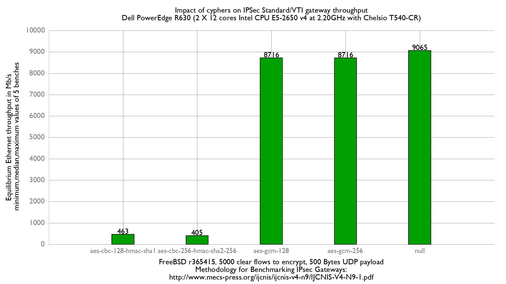

Impact of cyphers on IPsec VTI performance
  - Dell PowerEdge R630 with 2 Intel E5-2650 v4 2.2Ghz (2x12 cores)
  - Chelsio T520-CR
  - FreeBSD 13-head r365873
  - if_ipsec (VTI) mode
  - 5000 flows of clear UDP packets
  - 500Bytes UDP load => packet size: 528B => Ethernet frame size:542B

