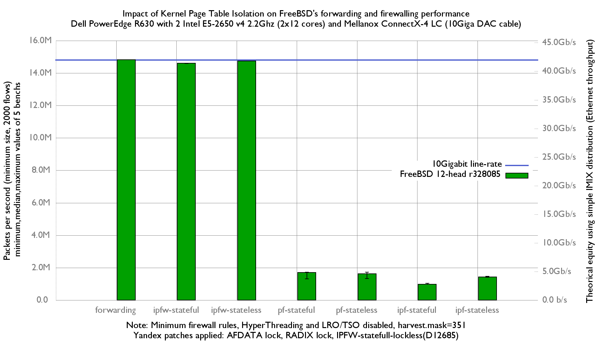

Impact of enabling firewalls on FreeBSD's forwarding performance
  - Dell PowerEdge R630 with 2 Intel E5-2650 v4 2.2Ghz (2x12 cores)
  - Mellanox ConnectX-4 LC (10Giga DAC cable)
  - FreeBSD 12-head r328085
  - Yandex patches applied: AFDATA lock, RADIX lock, IPFW-statefull-lockless(D12685)
  - Minimum firewall rules
  - HyperThreading and LRO/TSO disabled
  - harvest.mask=351

Flamegraph:
   - [forwarding](bench.forwarding.1.pmc.svg)
   - [ipfw-stateful](bench.ipfw-stateful.1.pmc.svg)
   - [ipfw-stateless](bench.ipfw-stateless.1.pmc.svg)
   - [pf-stateful](bench.pf-stateful.1.pmc.svg)
   - [pf-statefuless](bench.pf-stateless.1.pmc.svg)
   - [ipf-stateful](bench.ipf-stateful.1.pmc.svg)
   - [ipf-state](bench.ipf-stateless.1.pmc.svg)
