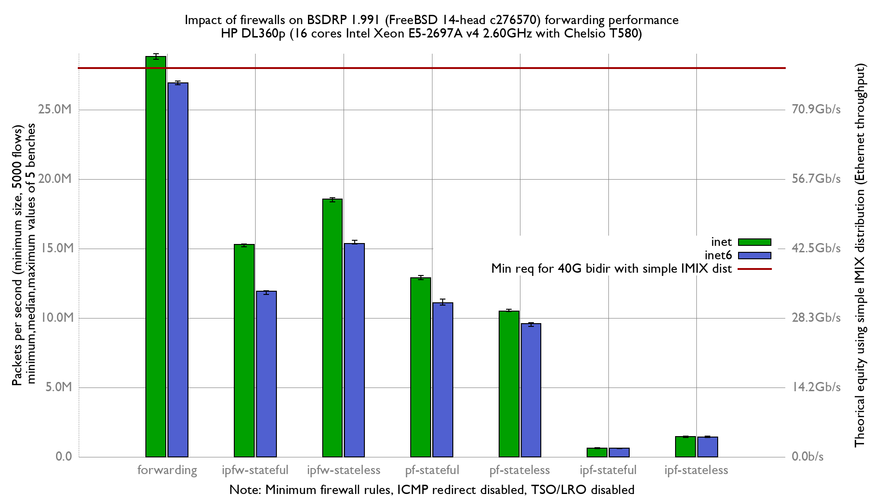

Impact of enabling firewalls on BSDRP 1.991 forwarding performance
  - Intel Xeon E5-2697Av4 (16Cores, 32 threads)
  - RX NIC (heavy work): Chelsio T580-LP-CR (QSFP+ 40GBASE-SR4)
  - TX NIC: Mellanox_ConnectX-4
  - Increase number of Chelsio RX & TX queues to 32
  - FreeBSD 14-head c276570
  - 5000 flows of smallest UDP packets
  - Traffic load at 42.49Mpps
  - 2 static routes
  - LRO/TSO disabled
  - harvest.mask=351
  - ICMP redirect disabled

