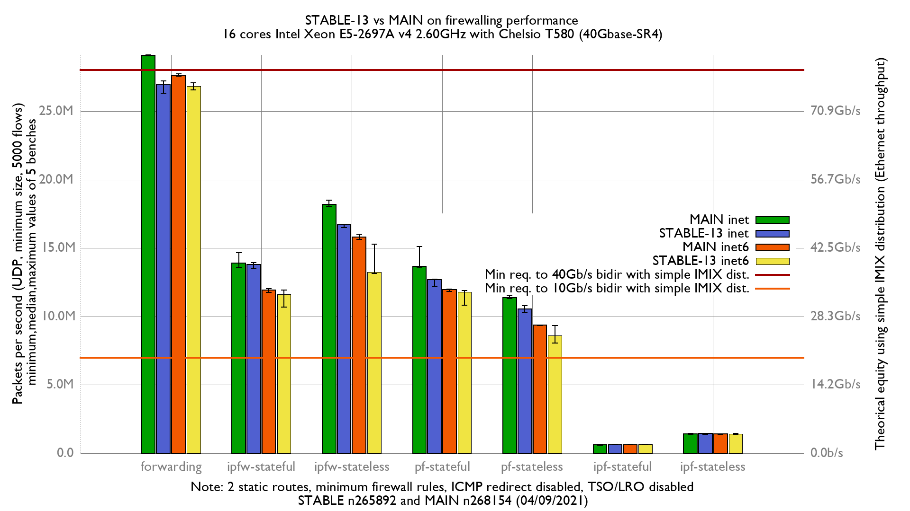

Comparing MAIN vs STABLE-13 on firewalling performance:
  - Intel Xeon E5-2697Av4 (16Cores, 32 threads)
  - RX NIC (heavy work): Chelsio T580-LP-CR (QSFP+ 40GBASE-SR4)
  - TX NIC: Mellanox_ConnectX-4
  - Increase number of Chelsio RX & TX queues to 32
  - FreeBSD STABLE n265892 and MAIN n268154
  - Traffic load at 42.49Mpps
  - 2 static routes
  - LRO/TSO disabled
  - harvest.mask=351
  - ICMP redirect disabled



Forwarding diff:

```
x STABLE13.forwarding.inet4.pps
+ MAIN.forwarding.inet4.pps
+--------------------------------------------------------------------------+
|                                                                       + +|
|x                x    xx                                               +++|
|     |__________A__M______|                                               |
|                                                                       |A||
+--------------------------------------------------------------------------+
    N           Min           Max        Median           Avg        Stddev
x   4      26317649      27217122      27061872      26914629     410402.65
+   5      29048619      29120288      29090342      29084260     29663.541
Difference at 95.0% confidence
	2.16963e+06 +/- 427727
	8.06116% +/- 1.71645%
	(Student's t, pooled s = 269606)
```

```
x STABLE13.forwarding.inet6.pps
+ MAIN.forwarding.inet6.pps
+--------------------------------------------------------------------------+
|x  x            x            x x                               + + + +   +|
| |______________A_____________|                                           |
|                                                                |__MA__|  |
+--------------------------------------------------------------------------+
    N           Min           Max        Median           Avg        Stddev
x   5      26569904      27063426      26824165      26821570     228087.35
+   5      27578369      27732120      27643505      27646290     58914.394
Difference at 95.0% confidence
	824720 +/- 242941
	3.07484% +/- 0.931899%
	(Student's t, pooled s = 166575)
```

IPFW diff:

```
x STABLE13.ipfw-stateless.inet4.pps
+ MAIN.ipfw-stateless.inet4.pps
+--------------------------------------------------------------------------+
|x      xxx                                               +   ++ +        +|
|   |__A_M_|                                                               |
|                                                          |___MA_____|    |
+--------------------------------------------------------------------------+
    N           Min           Max        Median           Avg        Stddev
x   5      16489275      16739783      16706170      16666688     100990.05
+   5      18070269      18502947      18193256      18238849     161506.63
Difference at 95.0% confidence
	1.57216e+06 +/- 196439
	9.43295% +/- 1.21092%
	(Student's t, pooled s = 134691)
```

```
x STABLE13.ipfw-stateful.inet4.pps
+ MAIN.ipfw-stateful.inet4.pps
+--------------------------------------------------------------------------+
|x     *      +    xx     +  x   +                                        +|
|   |__________A___M______|                                                |
|   |_____________________M____A_________________________|                 |
+--------------------------------------------------------------------------+
    N           Min           Max        Median           Avg        Stddev
x   5      13498056      13937430      13787662      13723512     176036.66
+   5      13587740      14660266      13893680      13970300     417375.14
No difference proven at 95.0% confidence
```

PF diff:

```
x STABLE13.pf-stateful.inet4.pps
+ MAIN.pf-stateful.inet4.pps
+--------------------------------------------------------------------------+
|x   x       xx                    +++ +                                  +|
|  |_____A___M_|                                                           |
|                           |________M______A________________|             |
+--------------------------------------------------------------------------+
    N           Min           Max        Median           Avg        Stddev
x   5      12223795      12723082      12677480      12541658     222761.13
+   5      13561145      15102932      13648817      13928698     659228.09
Difference at 95.0% confidence
	1.38704e+06 +/- 717610
	11.0595% +/- 5.78985%
	(Student's t, pooled s = 492039)
```

```
x STABLE13.pf-stateless.inet4.pps
+ MAIN.pf-stateless.inet4.pps
+--------------------------------------------------------------------------+
|                                                            +             |
|x  x          x       x      x                              +  + +       +|
| |____________A___________|                                               |
|                                                           |___MA____|    |
+--------------------------------------------------------------------------+
    N           Min           Max        Median           Avg        Stddev
x   5      10309062      10802570      10542491      10541138     210377.99
+   5      11325704      11547108      11375250      11396719     89938.899
Difference at 95.0% confidence
	855581 +/- 235952
	8.11659% +/- 2.3929%
	(Student's t, pooled s = 161784)
```
