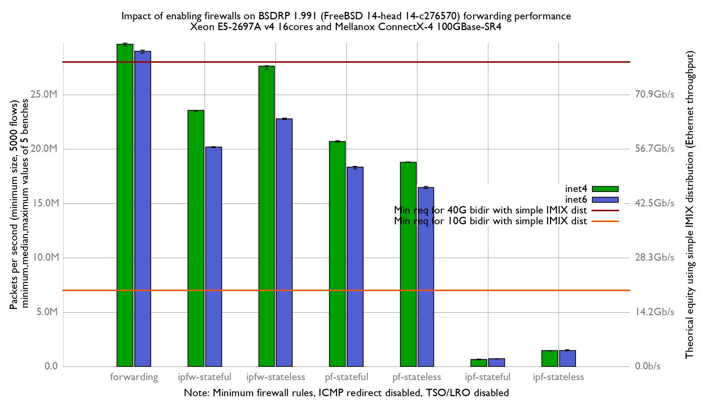

Impact of enabling firewalls on BSDRP 1.991 forwarding performance
  - Intel Xeon E5-2697Av4 (16Cores, 32 threads)
  - Mellanox ConnectX-4 MCX416A-CCAT (100GBase-SR4)
  - FreeBSD 14-head c276570
  - Minimum firewall rules
  - HyperThreading and LRO/TSO disabled
  - harvest.mask=351

