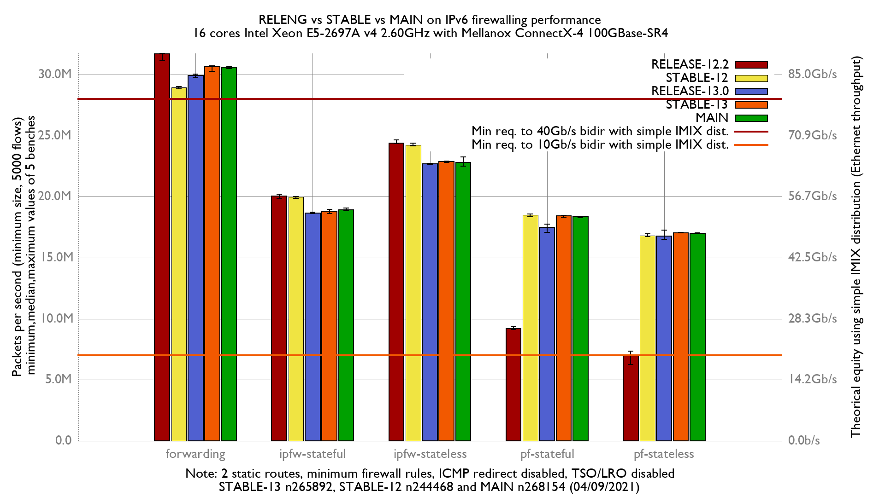

# Comparing releases vs stable vs main on firewalls performance (in term of packets-per-second only)

Setup:
  - Intel Xeon E5-2697Av4 (16Cores, 32 threads)
  - Input NIC: Mellanox ConnectX-4 MCX416A-CCAT (100GBase-SR4)
  - Output NIC: Chelsio T580 (QSFP+ 40GBASE-SR4 (MPO 1x12 Parallel Optic))
  - 2 static routes
  - LRO/TSO disabled
  - harvest.mask=351
  - Generator rate: 43.68Mpps
  - ICMP redirect disabled

# graphs




# ministat

## Forwarding

```
x RELEASE 12.2: inet4 packets-per-second forwarded
+ STABLE 12 n244468: inet4 packets-per-second forwarded
* RELEASE 13.0: inet4 packets-per-second forwarded
% STABLE 13 n265892: inet4 packets-per-second forwarded
# MAIN 268154: inet4 packets-per-second forwarded
+--------------------------------------------------------------------------+
|                                  #                                       |
|* *     %%  %%*  %            #  *# #O                  +   + ++       xxx|
|                                                                       |A||
|                                                          |__AM_|         |
||_____________M__A_________________|                                      |
|        |___A__|                                                          |
|                                |_A__|                                    |
+--------------------------------------------------------------------------+
    N           Min           Max        Median           Avg        Stddev
x   5      32367410      32469461      32434589      32418813     42957.629
+   5      31593045      31939491      31885042      31826067     140629.88
Difference at 95.0% confidence
	-592746 +/- 151643
	-1.8284% +/- 0.46704%
	(Student's t, pooled s = 103976)
*   5      28622928      30586160      29325907      29516145     916967.98
Difference at 95.0% confidence
	-2.90267e+06 +/- 946683
	-8.95365% +/- 2.91962%
	(Student's t, pooled s = 649105)
%   5      29021739      29508322      29223296      29219592     195117.68
Difference at 95.0% confidence
	-3.19922e+06 +/- 206039
	-9.86841% +/- 0.632791%
	(Student's t, pooled s = 141273)
#   5      30214599      30558470      30408798      30420704     134162.01
Difference at 95.0% confidence
	-1.99811e+06 +/- 145277
	-6.16343% +/- 0.44563%
	(Student's t, pooled s = 99611.3)
```

```
x RELEASE 12.2: inet6 packets-per-second forwarded
+ STABLE 12 n244468: inet6 packets-per-second forwarded
* RELEASE 13.0: inet6 packets-per-second forwarded
% STABLE 13 n265892: inet6 packets-per-second forwarded
# MAIN 268154: inet6 packets-per-second forwarded
+--------------------------------------------------------------------------+
|                           *                #  %                          |
|+ ++++                * *  *  *    %  %  # ### %        x         x   xx  |
|                                                            |______A__M__||
| |_A_|                                                                    |
|                       |__AM_|                                            |
|                                     |____A__M__|                         |
|                                          |AM|                            |
+--------------------------------------------------------------------------+
    N           Min           Max        Median           Avg        Stddev
x   5      31124324      31738558      31682776      31551978     255952.86
+   5      28830674      29033528      28934408      28943780     79104.886
Difference at 95.0% confidence
	-2.6082e+06 +/- 276277
	-8.26635% +/- 0.80981%
	(Student's t, pooled s = 189433)
*   5      29742334      30058276      29919720      29896202     121050.03
Difference at 95.0% confidence
	-1.65578e+06 +/- 291989
	-5.24777% +/- 0.885934%
	(Student's t, pooled s = 200206)
%   5      30251431      30733598      30660439      30550048     221572.25
Difference at 95.0% confidence
	-1.00193e+06 +/- 349123
	-3.17549% +/- 1.08655%
	(Student's t, pooled s = 239381)
#   5      30493652      30647868      30619234      30600742       62960.6
Difference at 95.0% confidence
	-951236 +/- 271826
	-3.01482% +/- 0.837049%
	(Student's t, pooled s = 186381)
```

## IPFW

### stateful

```
x RELEASE 12.2: inet4 packets-per-second forwarded
+ STABLE 12 n244468: inet4 packets-per-second forwarded
* RELEASE 13.0: inet4 packets-per-second forwarded
% STABLE 13 n265892: inet4 packets-per-second forwarded
# MAIN 268154: inet4 packets-per-second forwarded
+--------------------------------------------------------------------------+
|**    **  *   %% %%%                     x  **++# xx         #     ##    #|
|                                          |__MA____|                      |
|                                             |A|                          |
| |___AM__|                                                                |
|               |_A_|                                                      |
|                                                      |________A___M_____||
+--------------------------------------------------------------------------+
    N           Min           Max        Median           Avg        Stddev
x   5      21104009      21545248      21249307      21328425     189873.91
+   5      21239578      21348277      21301116      21294066     50859.508
No difference proven at 95.0% confidence
*   5      19253455      19706926      19514182      19473694     186277.96
Difference at 95.0% confidence
	-1.85473e+06 +/- 274310
	-8.69605% +/- 1.23041%
	(Student's t, pooled s = 188085)
%   5      19877270      20089529      20031521      19997944     93936.759
Difference at 95.0% confidence
	-1.33048e+06 +/- 218465
	-6.23807% +/- 0.973291%
	(Student's t, pooled s = 149794)
#   5      21400588      22512270      22241269      22076646     426486.97
Difference at 95.0% confidence
	748221 +/- 481444
	3.50809% +/- 2.27058%
	(Student's t, pooled s = 330108)
```

```
x RELEASE 12.2: inet6 packets-per-second forwarded
+ STABLE 12 n244468: inet6 packets-per-second forwarded
* RELEASE 13.0: inet6 packets-per-second forwarded
% STABLE 13 n265892: inet6 packets-per-second forwarded
# MAIN 268154: inet6 packets-per-second forwarded
+--------------------------------------------------------------------------+
|  *            #%                                              +          |
|*%* * *% % #   ##     #                                   +x  ++x+xx     x|
|                                                             |____A____|  |
|                                                           |__AM_|        |
| |MA_|                                                                    |
|   |_____MA_____|                                                         |
|            |__MA___|                                                     |
+--------------------------------------------------------------------------+
    N           Min           Max        Median           Avg        Stddev
x   5      19881266      20187986      20043298      20034239      111759.7
+   5      19858706      20015866      19971336      19952334     58688.073
No difference proven at 95.0% confidence
*   5      18607910      18727323      18662010      18665221     45260.598
Difference at 95.0% confidence
	-1.36902e+06 +/- 124348
	-6.83339% +/- 0.584425%
	(Student's t, pooled s = 85260.6)
%   5      18627190      18945122      18812345      18816510     134503.51
Difference at 95.0% confidence
	-1.21773e+06 +/- 180345
	-6.07824% +/- 0.878247%
	(Student's t, pooled s = 123656)
#   5      18852748      19080585      18936348      18948823     82608.701
Difference at 95.0% confidence
	-1.08542e+06 +/- 143323
	-5.4178% +/- 0.690574%
	(Student's t, pooled s = 98271.1)
```

### stateless

```
x RELEASE 12.2: inet4 packets-per-second forwarded
+ STABLE 12 n244468: inet4 packets-per-second forwarded
* RELEASE 13.0: inet4 packets-per-second forwarded
% STABLE 13 n265892: inet4 packets-per-second forwarded
# MAIN 268154: inet4 packets-per-second forwarded
+--------------------------------------------------------------------------+
|                                                                        # |
|                    * *                %%                               # |
|+               +++x*x* *  x       %   %%                              ###|
|                   |__A__|                                                |
|      |_______A__M____|                                                   |
|                    |_A|                                                  |
|                                     |_A_|                                |
|                                                                       |A||
+--------------------------------------------------------------------------+
    N           Min           Max        Median           Avg        Stddev
x   5      24809341      25164089      24935633      24950786     130103.67
+   5      24039066      24843390      24721330      24611244     324850.98
No difference proven at 95.0% confidence
*   5      24839971      25015289      24926671      24921783     69225.993
No difference proven at 95.0% confidence
%   5      25473603      25687378      25654968      25626524     86819.831
Difference at 95.0% confidence
	675738 +/- 161304
	2.70828% +/- 0.65865%
	(Student's t, pooled s = 110600)
#   5      26953336      27030413      26992305      26989665     28767.348
Difference at 95.0% confidence
	2.03888e+06 +/- 137413
	8.1716% +/- 0.59372%
	(Student's t, pooled s = 94219.2)
```

```
x RELEASE 12.2: inet6 packets-per-second forwarded
+ STABLE 12 n244468: inet6 packets-per-second forwarded
* RELEASE 13.0: inet6 packets-per-second forwarded
% STABLE 13 n265892: inet6 packets-per-second forwarded
# MAIN 268154: inet6 packets-per-second forwarded
+--------------------------------------------------------------------------+
|#   ** *O  #%#%          #                              + ++   x*x       x|
|                                                             |__M_A___|   |
|                                                        |__A__|           |
|     |AM|                                                                 |
|           |A_|                                                           |
|  |________A________|                                                     |
+--------------------------------------------------------------------------+
    N           Min           Max        Median           Avg        Stddev
x   5      24348916      24651640      24388716      24433916     124721.14
+   5      24165428      24376848      24227860      24243631     79732.345
Difference at 95.0% confidence
	-190285 +/- 152659
	-0.778775% +/- 0.621332%
	(Student's t, pooled s = 104672)
*   5      22635565      22735658      22697214      22683590     45301.232
Difference at 95.0% confidence
	-1.75033e+06 +/- 136843
	-7.16351% +/- 0.52477%
	(Student's t, pooled s = 93828.5)
%   5      22813070      22914508      22869971      22870248     40756.041
Difference at 95.0% confidence
	-1.56367e+06 +/- 135315
	-6.39958% +/- 0.521883%
	(Student's t, pooled s = 92780.4)
#   5      22503898      23244320      22812874      22838154     267455.73
Difference at 95.0% confidence
	-1.59576e+06 +/- 304336
	-6.53093% +/- 1.23141%
	(Student's t, pooled s = 208672)
```

## PF
### stateful

```
x RELEASE 12.2: inet4 packets-per-second forwarded
+ STABLE 12 n244468: inet4 packets-per-second forwarded
* RELEASE 13.0: inet4 packets-per-second forwarded
% STABLE 13 n265892: inet4 packets-per-second forwarded
# MAIN 268154: inet4 packets-per-second forwarded
+--------------------------------------------------------------------------+
|                                                                     %  # |
|   x                                                            **  +%% ##|
|x xxx                                                         * ** ++@% ##|
| |AM|                                                                     |
|                                                                   |A|    |
|                                                               |A|        |
|                                                                     A|   |
|                                                                        A||
+--------------------------------------------------------------------------+
    N           Min           Max        Median           Avg        Stddev
x   5       8774524       9277318     9206363.5       9125954     206641.31
+   5      18366003      18662109      18486343      18481123     114595.05
Difference at 95.0% confidence
	9.35517e+06 +/- 243679
	102.512% +/- 4.90304%
	(Student's t, pooled s = 167082)
*   5      17562558      17998128      17909274      17861549     173657.28
Difference at 95.0% confidence
	8.73559e+06 +/- 278363
	95.7225% +/- 4.97389%
	(Student's t, pooled s = 190863)
%   5      18537085      18699453      18609378      18616443     76083.834
Difference at 95.0% confidence
	9.49049e+06 +/- 227090
	103.994% +/- 4.84053%
	(Student's t, pooled s = 155707)
#   5      19017950      19167008      19070951      19081386     57600.134
Difference at 95.0% confidence
	9.95543e+06 +/- 221228
	109.089% +/- 4.92573%
	(Student's t, pooled s = 151688)
```

```
x RELEASE 12.2: inet6 packets-per-second forwarded
+ STABLE 12 n244468: inet6 packets-per-second forwarded
* RELEASE 13.0: inet6 packets-per-second forwarded
% STABLE 13 n265892: inet6 packets-per-second forwarded
# MAIN 268154: inet6 packets-per-second forwarded
+--------------------------------------------------------------------------+
|                                                                       #% |
|x x                                                              *     #O |
|xxx                                                          **  * *   OO+|
||A|                                                                       |
|                                                                       |A||
|                                                              |_AM|       |
|                                                                       |A |
|                                                                       A| |
+--------------------------------------------------------------------------+
    N           Min           Max        Median           Avg        Stddev
x   5       9103434       9381536       9213384     9243731.4     126936.08
+   5      18344538      18586292      18520106      18480728     93753.083
Difference at 95.0% confidence
	9.237e+06 +/- 162740
	99.9271% +/- 3.01831%
	(Student's t, pooled s = 111585)
*   5      17060088      17771519      17483757      17399916     283549.49
Difference at 95.0% confidence
	8.15618e+06 +/- 320381
	88.2348% +/- 4.13681%
	(Student's t, pooled s = 219674)
%   5      18313030      18472666      18439050      18413452     63139.676
Difference at 95.0% confidence
	9.16972e+06 +/- 146206
	99.1993% +/- 2.9076%
	(Student's t, pooled s = 100248)
#   5      18291554      18409186      18383382      18366652     46727.564
Difference at 95.0% confidence
	9.12292e+06 +/- 139494
	98.693% +/- 2.86169%
	(Student's t, pooled s = 95645.8)
```

### stateless

```
x RELEASE 12.2: inet4 packets-per-second forwarded
+ STABLE 12 n244468: inet4 packets-per-second forwarded
* RELEASE 13.0: inet4 packets-per-second forwarded
% STABLE 13 n265892: inet4 packets-per-second forwarded
# MAIN 268154: inet4 packets-per-second forwarded
+--------------------------------------------------------------------------+
|                                                                      % # |
|      x                                                            +  O ##|
|x x x x                                                        +   +**O*##|
| |__A_|                                                                   |
|                                                                 |AM|     |
|                                                                     |A|  |
|                                                                      A   |
|                                                                        MA|
+--------------------------------------------------------------------------+
    N           Min           Max        Median           Avg        Stddev
x   5       6366846       7332137       7047358     6928387.3     419535.19
+   5      16214125      16829113      16810045      16696258      269657.3
Difference at 95.0% confidence
	9.76787e+06 +/- 514321
	140.983% +/- 15.5747%
	(Student's t, pooled s = 352651)
*   5      16971282      17429501      17250284      17207277     186724.07
Difference at 95.0% confidence
	1.02789e+07 +/- 473574
	148.359% +/- 15.7563%
	(Student's t, pooled s = 324712)
%   5      17185188      17275847      17244617      17236758     37933.841
Difference at 95.0% confidence
	1.03084e+07 +/- 434421
	148.785% +/- 15.5461%
	(Student's t, pooled s = 297866)
#   5      17601186      17716213      17633636      17644638     43061.854
Difference at 95.0% confidence
	1.07163e+07 +/- 434929
	154.672% +/- 15.9164%
	(Student's t, pooled s = 298215)
```

```
x RELEASE 12.2: inet6 packets-per-second forwarded
+ STABLE 12 n244468: inet6 packets-per-second forwarded
* RELEASE 13.0: inet6 packets-per-second forwarded
% STABLE 13 n265892: inet6 packets-per-second forwarded
# MAIN 268154: inet6 packets-per-second forwarded
+--------------------------------------------------------------------------+
|                                                                       #% |
|                                                                       ## |
|x x  xxx                                                            ***OO*|
| |__AM_|                                                                  |
|                                                                      A|  |
|                                                                    |_A_| |
|                                                                       |A |
|                                                                       A| |
+--------------------------------------------------------------------------+
    N           Min           Max        Median           Avg        Stddev
x   5     6251151.5       7352582     7011198.5     6864498.8     463511.29
+   5      16754813      16947755      16811441      16824209     73574.671
Difference at 95.0% confidence
	9.95971e+06 +/- 483992
	145.09% +/- 17.1025%
	(Student's t, pooled s = 331855)
*   5      16524278      17252124      16789819      16849129      319995.4
Difference at 95.0% confidence
	9.98463e+06 +/- 580856
	145.453% +/- 17.7553%
	(Student's t, pooled s = 398271)
%   5      17027648      17073196      17033456      17042082     18992.432
Difference at 95.0% confidence
	1.01776e+07 +/- 478409
	148.264% +/- 17.2901%
	(Student's t, pooled s = 328027)
#   5      16974244      17038360      16991736      17003846     27383.245
Difference at 95.0% confidence
	1.01393e+07 +/- 478841
	147.707% +/- 17.2539%
	(Student's t, pooled s = 328323)
```
