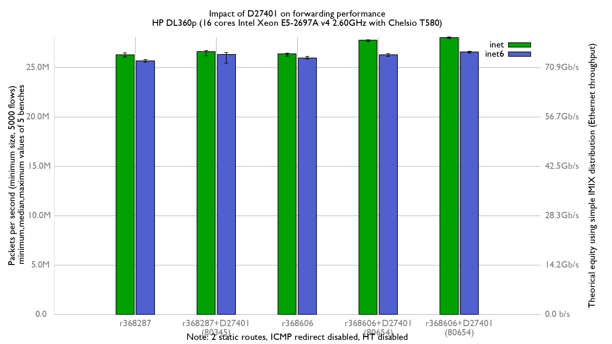

Comparing D27401 impact on forwarding performance:
  - Intel Xeon E5-2697Av4 (16Cores, 32 threads)
  - RX NIC (heavy work): Chelsio T580-LP-CR (QSFP+ 40GBASE-SR4)
  - TX NIC: Mellanox_ConnectX-4
  - Increase number of Chelsio RX & TX queues to 32
  - 5000 flows of smallest UDP packets
  - Traffic load at 42.49Mpps
  - 2 static routes
  - LRO/TSO disabled
  - harvest.mask=351
  - ICMP redirect disabled



IPv4:
```
x r368287: inet packets-per-second forwarded
+ r368287 with D27401(diff 80345): inet packets-per-second forwarded
* r368606: inet packets-per-second forwarded
% r368606 with D27401(diff 80654): inet packets-per-second forwarded
# r368606 with D27401(diff 80677): inet packets-per-second forwarded
+--------------------------------------------------------------------------+
|x   *+ x*  x***x    ++  +                                %%  % %   # # ###|
|   |____A_____|                                                           |
|       |________A___M___|                                                 |
|       |___AM__|                                                          |
|                                                         |__AM_|          |
|                                                                    |_AM_||
+--------------------------------------------------------------------------+
    N           Min           Max        Median           Avg        Stddev
x   5      26043204      26474164      26271894      26278590      158541.2
+   5      26192506      26710976      26604565      26482140     235981.16
No difference proven at 95.0% confidence
*   5      26157775      26431450      26368790      26347369     109573.77
No difference proven at 95.0% confidence
%   5      27628029      27807973      27754809      27725438     71953.184
Difference at 95.0% confidence
	1.44685e+06 +/- 179550
	5.5058% +/- 0.71459%
	(Student's t, pooled s = 123111)
#   5      27928702      28090098      28026012      28017081     61989.823
Difference at 95.0% confidence
	1.73849e+06 +/- 175553
	6.61562% +/- 0.70654%
	(Student's t, pooled s = 120370)
```

IPv6:
```
x r368287: inet6 packets-per-second forwarded
+ r368287 with D27401(diff 80345): inet6 packets-per-second forwarded
* r368606: inet6 packets-per-second forwarded
% r368606 with D27401(diff 80654): inet6 packets-per-second forwarded
# r368606 with D27401(diff 80677): inet6 packets-per-second forwarded
+--------------------------------------------------------------------------+
|+    x       xx     xx    *     * *     +O%       %   +%  %  O  +  ## #  #|
|         |____MA_____|                                                    |
|                  |_________________________A_________M_______________|   |
|                            |___MA_____|                                  |
|                                          |_______A______|                |
|                                                               |____A___| |
+--------------------------------------------------------------------------+
    N           Min           Max        Median           Avg        Stddev
x   5      25526827      25788390      25672590      25683064     104132.99
+   5      25435411      26509566      26331454      26166040     437883.44
Difference at 95.0% confidence
	482976 +/- 464172
	1.88052% +/- 1.80914%
	(Student's t, pooled s = 318265)
*   5      25874548      26122300      25971442      25988782     89708.604
Difference at 95.0% confidence
	305719 +/- 141744
	1.19035% +/- 0.555678%
	(Student's t, pooled s = 97188.8)
%   5      26126658      26409495      26275708      26261256     125438.14
Difference at 95.0% confidence
	578192 +/- 168128
	2.25126% +/- 0.660676%
	(Student's t, pooled s = 115279)
#   5      26447485      26652786      26566043      26566394     76994.289
Difference at 95.0% confidence
	883330 +/- 133556
	3.43935% +/- 0.531649%
	(Student's t, pooled s = 91574.6)
```

Flamegraphs:
- [r368287: inet4](bench.r368287.inet4.svg)
- [r368287 with D27401(diff 80345): inet4](bench.r368287D27401v2.inet4.svg)
- [r368606: inet4](bench.r368606.inet4.svg)
- [r368606 with D27401(diff 80654): inet4](bench.r368606D27401v3.inet4.svg)
- [r368606 with D27401(diff 80677): inet4](bench.r368606D27401v4.inet4.svg)
- [r368287: inet6](bench.r368287.inet6.svg)
- [r368287 with D27401(diff 80345): inet6](bench.r368287D27401v2.inet6.svg)
- [r368606: inet6](bench.r368606.inet6.svg)
- [r368606 with D27401(diff 80654): inet6](bench.r368606D27401v3.inet6.svg)
- [r368606 with D27401(diff 80677): inet6](bench.r368606D27401v4.inet6.svg)
