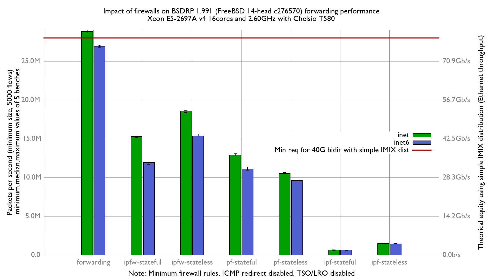

# Impact of enabling firewalls on BSDRP 1.991 forwarding performance
Lab:
  - Intel Xeon E5-2697Av4 (16Cores, 32 threads)
  - RX NIC (heavy work): Chelsio T580-LP-CR (QSFP+ 40GBASE-SR4)
  - TX NIC: Mellanox_ConnectX-4
  - Increase number of Chelsio RX & TX queues to 32
  - FreeBSD 14-head c276570
  - 5000 flows of smallest UDP packets
  - Traffic load at 42.49Mpps
  - 2 static routes
  - LRO/TSO disabled
  - harvest.mask=351
  - ICMP redirect disabled

# Results

## Graph

## flamegraph

### inet

  - [forwarding: inet](bench.forwarding.inet4.svg)
  - [ipfw-stateless: inet](bench.ipfw-stateless.inet4.svg)
  - [ipfw-stateful: inet](bench.ipfw-stateful.inet4.svg)
  - [pf-stateless: inet](bench.pf-stateful.inet4.svg)
  - [pf-stateful: inet](bench.pf-stateless.inet4.svg)
  - [ipf-stateless: inet](bench.ipf-stateless.inet4.svg)
  - [ipf-stateful: inet](bench.ipf-stateful.inet4.svg)

## inet6

  - [forwarding: inet6](bench.forwarding.inet6.svg)
  - [ipfw-stateless: inet6](bench.ipfw-stateless.inet6.svg)
  - [ipfw-stateful: inet6](bench.ipfw-stateful.inet6.svg)
  - [pf-stateless: inet6](bench.pf-stateless.inet6.svg)
  - [pf-stateful: inet6](bench.pf-stateful.inet6.svg)
  - [ipf-stateless: inet6](bench.ipf-stateful.inet6.svg)
  - [ipf-stateful: inet6](bench.ipf-stateless.inet6.svg)
