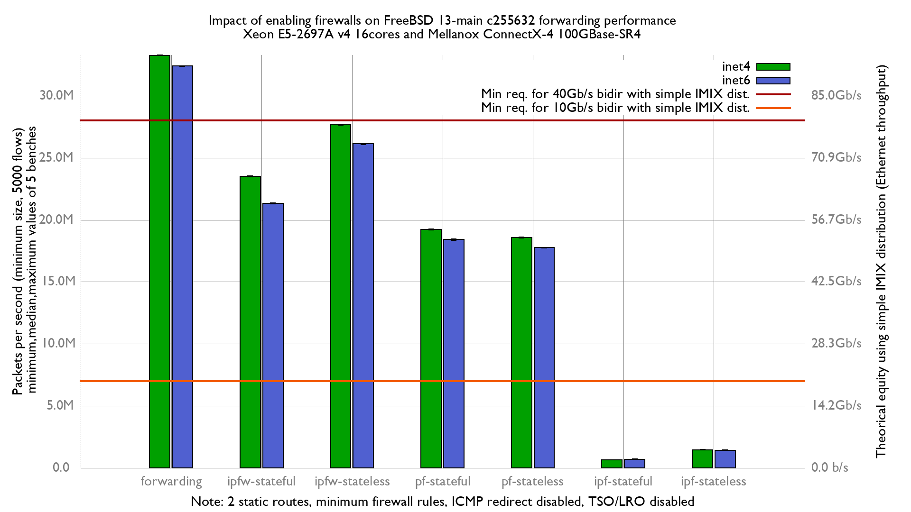

Impact of enabling firewalls on forwarding performance
  - Intel Xeon E5-2697Av4 (16Cores, 32 threads)
  - Input NIC: Mellanox ConnectX-4 MCX416A-CCAT (100GBase-SR4)
  - Output NIC: Chelsio T580 (QSFP+ 40GBASE-SR4)
  - FreeBSD 13-main (c255632)
  - Minimum firewall rules
  - 2 static routes
  - 5000 flows of smallest UDP packets at 43.68 Mpps
  - HyperThreading and LRO/TSO disabled
  - harvest.mask=351

