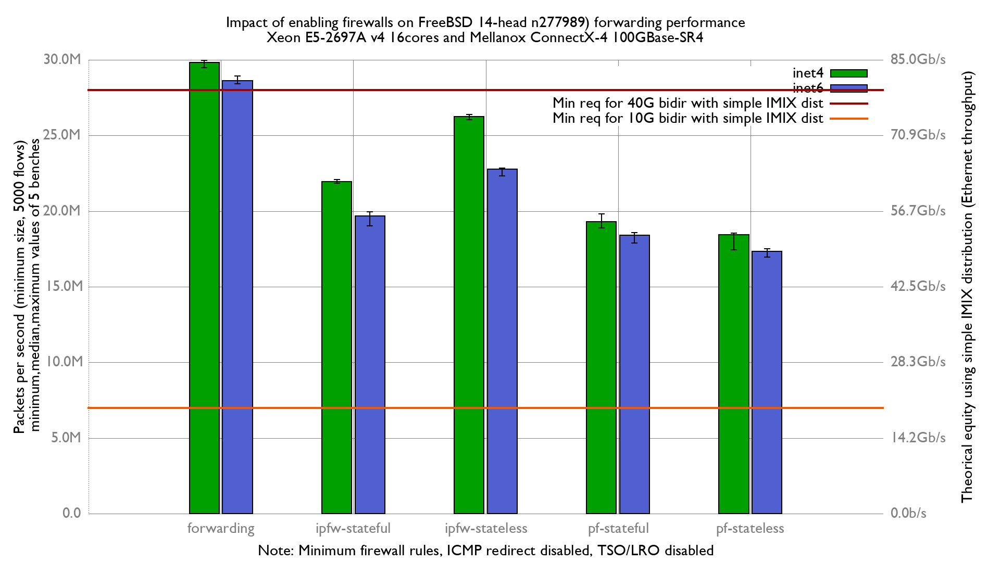

# Impact of enabling firewalls on FreeBSD 14 n277989 forwarding performance
Lab:
  - Intel Xeon E5-2697Av4 (16Cores, 32 threads)
  - Input NIC: Mellanox ConnectX-4 MCX416A-CCAT (100GBase-SR4)
  - Output NIC: Chelsio T580 (40Gbase-SR4)
  - FreeBSD 14-head n277989 (2022/09/09)
  - Minimum firewall rules
  - HyperThreading and LRO/TSO disabled
  - harvest.mask=351
  - Traffic generator rate (received by input NIC): 42Mpps

# Results

## Graph

## flamegraph

### inet

  - [forwarding: inet](bench.forwarding.inet4.svg)
  - [ipfw-stateless: inet](bench.ipfw-stateless.inet4.svg)
  - [ipfw-stateful: inet](bench.ipfw-stateful.inet4.svg)
  - [pf-stateless: inet](bench.pf-stateful.inet4.svg)
  - [pf-stateful: inet](bench.pf-stateless.inet4.svg)

## inet6

  - [forwarding: inet6](bench.forwarding.inet6.svg)
  - [ipfw-stateless: inet6](bench.ipfw-stateless.inet6.svg)
  - [ipfw-stateful: inet6](bench.ipfw-stateful.inet6.svg)
  - [pf-stateless: inet6](bench.pf-stateless.inet6.svg)
  - [pf-stateful: inet6](bench.pf-stateful.inet6.svg)
