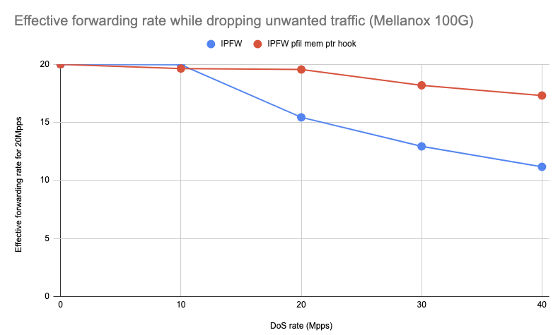

Impact of DDoS on forwarding 20Mpps traffic
  - Intel Xeon CPU E5-2697A v4 @ 2.60GHz (16 cores, 32 threads)
  - Mellanox ConnectX-4 MCX416A-CCAT (QSFP28 100GBASE-SR4)
  - FreeBSD 13.0-CURRENT r357572

