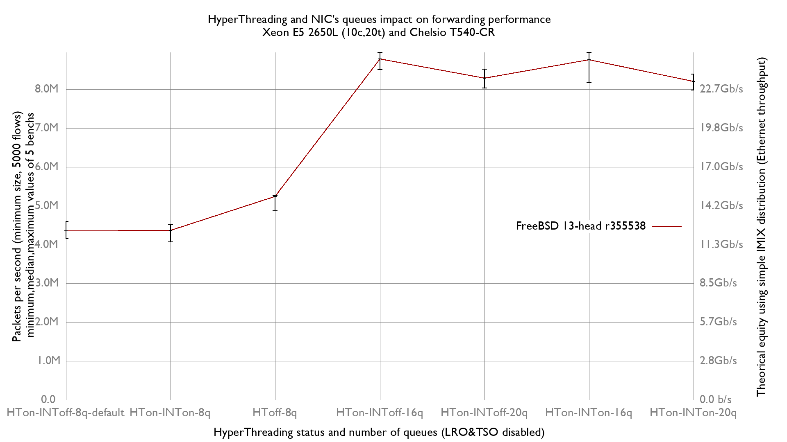

HyperThreading status and number of NIC's queues vs forwarding performance
  - Intel(R) Xeon(R) CPU E5-2650L v2 @ 1.70GHz (10c, 20t)
  - Chelsio T540-CR
  - FreeBSD 13-r355538



```
x HTon-INToff-8q-default.pps
+ HToff-8q.pps
* HTon-INToff-16q.pps
% HTon-INTon-16q.pps
# HTon-INToff-20q.pps
@ HTon-INTon-20q.pps
+--------------------------------------------------------------------------+
|                                                           # @            |
|xx x x x   +   +++                                        @# @@#O O * O% O|
||__A__|                                                                   |
|             |_AM_|                                                       |
|                                                                   |__A__||
|                                                              |_____A_M__||
|                                                           |__AM_|        |
|                                                           |_A__|         |
+--------------------------------------------------------------------------+
    N           Min           Max        Median           Avg        Stddev
x   5       4150350       4600419       4350560     4362451.9     182734.91
+   5     4876037.5       5257120     5235830.5       5152742     159621.05
Difference at 95.0% confidence
	790290 +/- 250222
	18.1157% +/- 6.34609%
	(Student's t, pooled s = 171568)
*   5     8507425.5       8948478     8780824.5       8763930      193723.5
Difference at 95.0% confidence
	4.40148e+06 +/- 274638
	100.895% +/- 9.81249%
	(Student's t, pooled s = 188309)
%   5       8175902       8951441       8765506     8599465.6     343361.44
Difference at 95.0% confidence
	4.23701e+06 +/- 401124
	97.1246% +/- 11.7643%
	(Student's t, pooled s = 275036)
#   5       8034616       8520098       8283773     8251829.2      210962.5
Difference at 95.0% confidence
	3.88938e+06 +/- 287829
	89.1558% +/- 9.57285%
	(Student's t, pooled s = 197354)
@   5       7980928       8392740     8198033.5     8189145.1      146887.9
Difference at 95.0% confidence
	3.82669e+06 +/- 241785
	87.7189% +/- 8.82129%
	(Student's t, pooled s = 165783)
```
