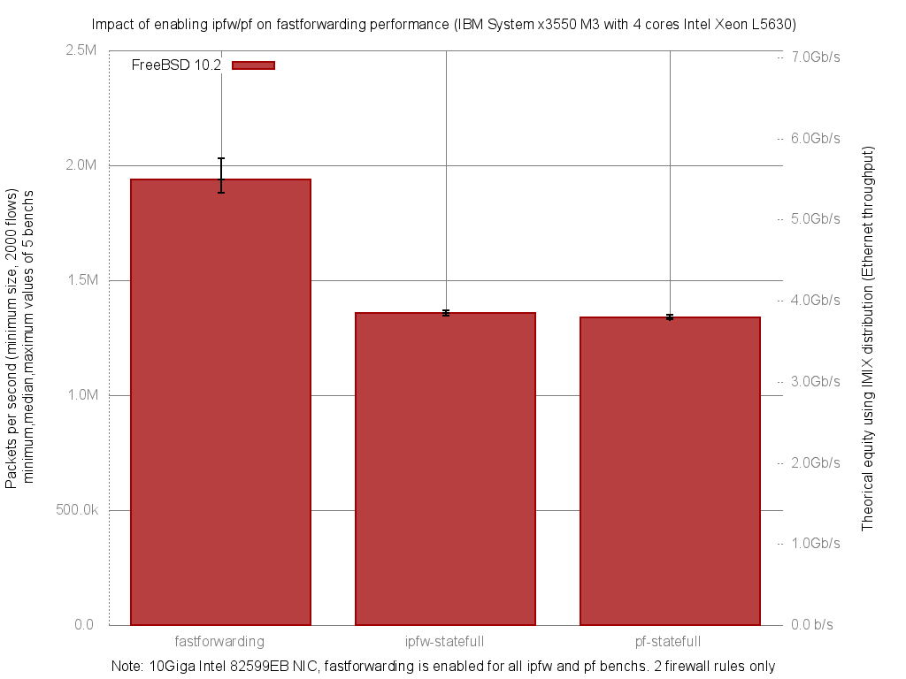

Impact of enabling ipfw or pf on forwarding performance
  - IBM System x3550 M3 with quad cores (Intel Xeon L5630 2.13GHz, hyper-threading disabled)
  - Dual port Intel 82599EB 10-Gigabit and OPT SFP (SFP-10G-LR)
  - FreeBSD 10.2
  - 2000 flows of smallest UDP packets
  - 2 firewall rules, 2 static routes
  - Traffic load at 14.48Mpps (10Gigabit line-rate)




```
x pps.fastforwarding
+ pps.ipfw-statefull
* pps.pf-statefull
+------------------------------------------------------------------------+
|** +                                                                    |
|***++                                                   x   x x      x x|
|                                                         |____MA______| |
|  |A|                                                                   |
||A|                                                                     |
+------------------------------------------------------------------------+
    N           Min           Max        Median           Avg        Stddev
x   5       1881360       2030174       1937233     1956174.4     62362.625
+   5       1346242       1368233       1357976       1358240     8228.3521
Difference at 95.0% confidence
	-597934 +/- 64870.4
	-30.5665% +/- 3.31619%
	(Student's t, pooled s = 44479.2)
*   5       1330457       1351029       1337491       1339611     8080.1759
Difference at 95.0% confidence
	-616563 +/- 64850.6
	-31.5188% +/- 3.31517%
	(Student's t, pooled s = 44465.6)
```
