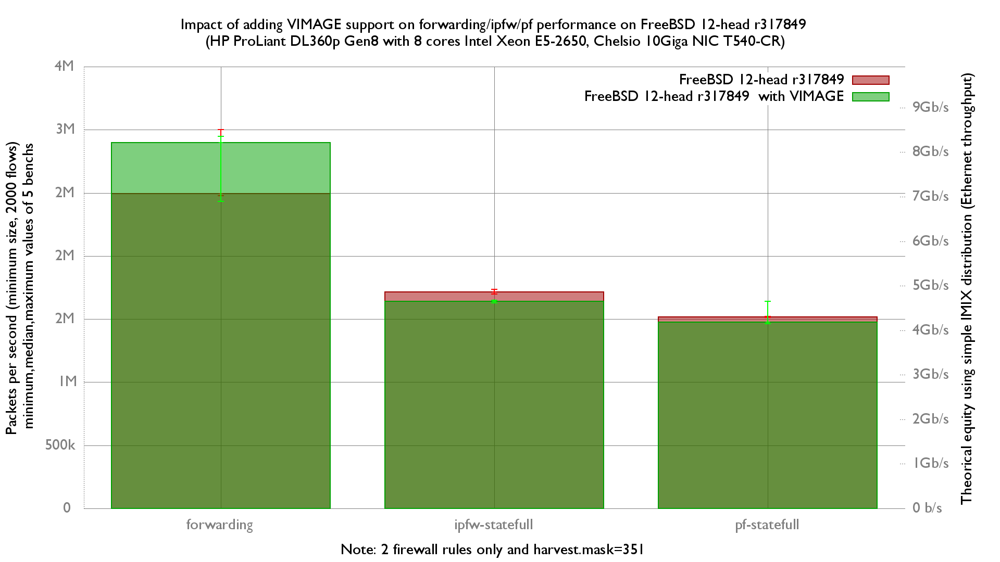

Impact of adding VIMAGE support on forwarding/ipfw/pf performance
  - IBM System x3550 M3 with quad cores (Intel Xeon L5630 2.13GHz, hyper-threading disabled)
  - Dual port Intel 82599EB 10-Gigabit and OPT SFP (SFP-10G-LR)
  - FreeBSD 12-head r317849
  - 2000 flows of smallest UDP packets
  - 2 static routes
  - Traffic load at 14.88 Mpps




forwarding performance is not impacted:
```
x r317849 forwarding (packets-per-seconds)
+ r317849 with VIMAGE forwarding (packets-per-seconds)
+--------------------------------------------------------------------------+
|  +  +  xxx                                                 + +   +x     x|
||_________M______________________A_________________________________|      |
|       |_______________________________A____________________M___________| |
+--------------------------------------------------------------------------+
    N           Min           Max        Median           Avg        Stddev
x   5       2479400       3001149       2495983     2683109.5     268499.85
+   5       2430788       2947315       2896322     2728679.2      261041.9
No difference proven at 95.0% confidence
```

ipfw performance decrease about -4.4%:

```
x r317849 ipfw-statefull (packets-per-seconds)
+ r317849 with VIMAGE ipfw-statefull (packets-per-seconds)
+--------------------------------------------------------------------------+
|+                                                         x               |
|+       + +  +                                 x       x  x              x|
|                                                 |________A_________|     |
||_____A_M___|                                                             |
+--------------------------------------------------------------------------+
    N           Min           Max        Median           Avg        Stddev
x   5       1697431       1735744       1713634     1713976.2     13928.908
+   5       1628365       1648186       1640066       1637521     8792.1546
Difference at 95.0% confidence
        -76455.2 +/- 16986.8
        -4.46069% +/- 0.959672%
        (Student's t, pooled s = 11647.2)
```

pf performance is not impacted:

```
+ r317849 with VIMAGE.pf-statefull (packets-per-seconds)
+--------------------------------------------------------------------------+
|            ++  + +          xx x                                        +|
|                             |MA|                                         |
||_______________M_________A_________________________|                     |
+--------------------------------------------------------------------------+
    N           Min           Max        Median           Avg        Stddev
x   5       1513074       1523053       1517192     1517778.8       4621.53
+   5       1464249       1639369     1475619.5     1505373.4     75189.149
No difference proven at 95.0% confidence
```

flame graph:
   - [r317849 and forwarding](bench.317849.forwarding.svg)
   - [r317849 and ipfw-statefull](bench.317849.ipfw-statefull.svg)
   - [r317849 and pf-statefull](bench.317849.pf-statefull.svg)
   - [r317849 with VIMAGE and forwarding](bench.317849VIMAGE.forwarding.svg)
   - [r317849 with VIMAGE and ipfw-statefull](bench.317849VIMAGE.ipfw-statefull.svg)
   - [r317849 with VIMAGE and pf-statefull](bench.317849VIMAGE.pf-statefull.svg)

They were generated with this command:
```
stackcollapse-pmc.pl bench.312905.1.pmc.graph | flamegraph.pl > bench.312905.svg

```
