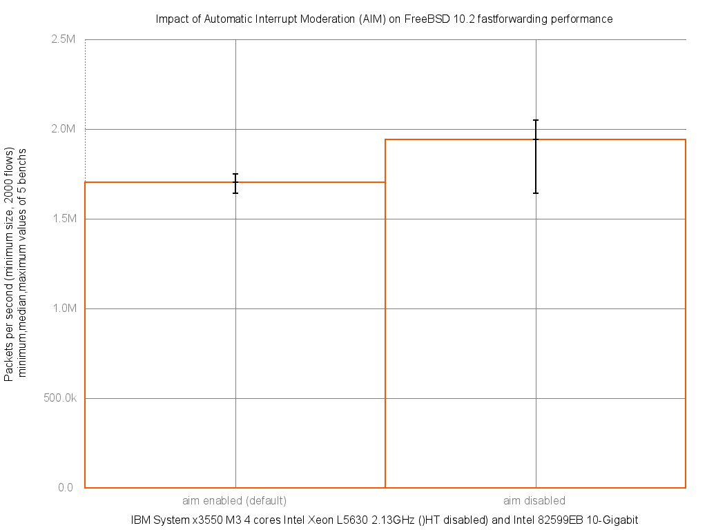

Impact of AIM with Intel 82599EB on forwarding performance
  - IBM System x3550 M3 with quad cores (Intel Xeon L5630 2.13GHz, hyper-threading disabled)
  - Dual port Intel 82599EB 10-Gigabit and OPT SFP (SFP-10G-LR)
  - FreeBSD 10.2
  - 2000 flows of smallest UDP packets
  - Traffic load at 14.48Mpps (10Gigabit line-rate)




```
x pps.aim_enabled_default
+ pps.aim_disabled
+--------------------------------------------------------------------------+
|                                                    +                     |
|*     x    xx      x                                +    +            +   |
|   |_____A_M____|                                                         |
|                   |__________________________A_____M____________________||
+--------------------------------------------------------------------------+
    N           Min           Max        Median           Avg        Stddev
x   5       1643449       1748931       1703457     1695941.8     39624.083
+   5       1641107       2049529       1942324     1908779.6     156044.91
Difference at 95.0% confidence
	212838 +/- 166032
	12.5498% +/- 9.78997%
	(Student's t, pooled s = 113842)
```
