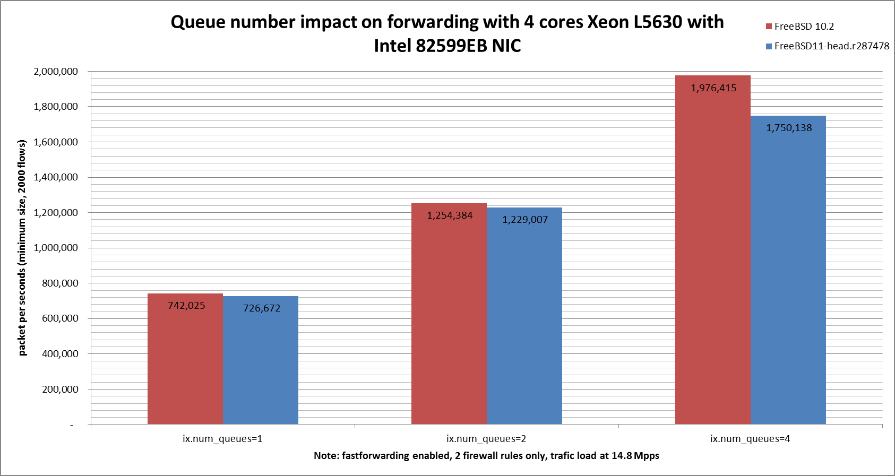

Impact of Intel 82599EB queue number on forwarding performance
  - IBM System x3550 M3 with quad cores (Intel Xeon L5630 2.13GHz, hyper-threading disabled)
  - Dual port Intel 82599EB 10-Gigabit and OPT SFP (SFP-10G-LR)
  - FreeBSD 11-head.r287478
  - 2000 flows of smallest UDP packets
  - Traffic load at 14.48Mpps (10Gigabit line-rate)




```
x pps.one
+ pps.two
* pps.four
+--------------------------------------------------------------------------+
|   x                        +                         *                   |
|  xx          x            ++                     **  *                  *|
||__M_A____|                                                               |
|                           |A                                             |
|                                               |______M_A_________|       |
+--------------------------------------------------------------------------+
    N           Min           Max        Median           Avg        Stddev
x   5        716160        943875        726672      768246.4     98310.728
+   5       1216311       1235802       1229007     1226484.2     7488.0917
Difference at 95.0% confidence
	458238 +/- 101679
	59.6472% +/- 13.2352%
	(Student's t, pooled s = 69717.5)
*   5       1676267       2134774       1750138     1800763.6     190236.75
Difference at 95.0% confidence
	1.03252e+06 +/- 220835
	134.399% +/- 28.7453%
	(Student's t, pooled s = 151418)
```
