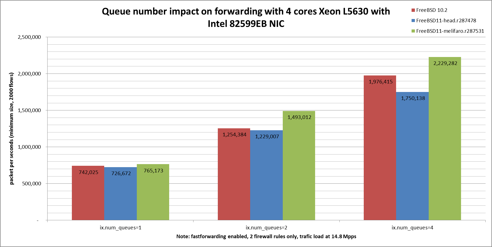

Impact of Intel 82599EB queue number on forwarding performance
  - IBM System x3550 M3 with quad cores (Intel Xeon L5630 2.13GHz, hyper-threading disabled)
  - Dual port Intel 82599EB 10-Gigabit and OPT SFP (SFP-10G-LR)
  - FreeBSD 11-head.project/routing 287531
  - 2000 flows of smallest UDP packets
  - Traffic load at 14.48Mpps (10Gigabit line-rate)




```
x pps.one
+ pps.two
* pps.four
+------------------------------------------------------------------------+
|x                       +                      *                        |
|x                      ++                      *                        |
|x                      ++                      *                  *    *|
|A                                                                       |
|                       |A                                               |
|                                            |__M________A___________|   |
+------------------------------------------------------------------------+
    N           Min           Max        Median           Avg        Stddev
x   5        759291        773763        765173        766550      6599.305
+   5       1470491       1500417       1493012     1488466.2     11822.901
Difference at 95.0% confidence
	721916 +/- 13963.5
	94.1773% +/- 1.8216%
	(Student's t, pooled s = 9574.23)
*   5       2211060       2960408       2229282       2488692     370125.23
Difference at 95.0% confidence
	1.72214e+06 +/- 381761
	224.661% +/- 49.8025%
	(Student's t, pooled s = 261760)
```
