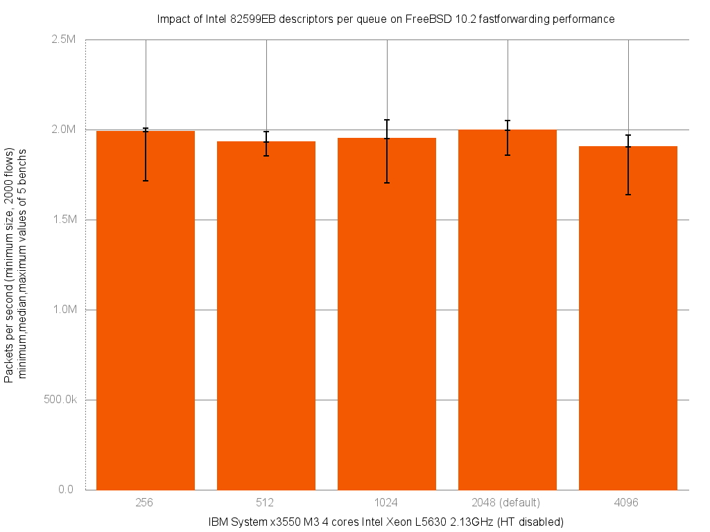

Impact of Intel 82599EB descriptors per queue on forwarding performance
  - IBM System x3550 M3 with quad cores (Intel Xeon L5630 2.13GHz, hyper-threading disabled)
  - Dual port Intel 82599EB 10-Gigabit and OPT SFP (SFP-10G-LR)
  - FreeBSD 10.2
  - 2000 flows of smallest UDP packets
  - Traffic load at 14.48Mpps (10Gigabit line-rate)




```
x pps.256
+ pps.512
* pps.1024
% pps.2048
# pps.4096
+--------------------------------------------------------------------------+
|#          * x   *                   O       O   +#  *+ # #+x%x      %O   |
|                             |_____________________A________M___________| |
|                                        |________A________|               |
|                |___________________________A________M___________________||
|                                              |____________A_M__________| |
|                |_____________________A______M______________|             |
+--------------------------------------------------------------------------+
    N           Min           Max        Median           Avg        Stddev
x   5       1714207       2005981       1989521     1936624.8     124630.33
+   5       1854108       1987091       1928984       1927188     50921.176
No difference proven at 95.0% confidence
*   5       1703546       2054228       1948947     1899915.8     169257.24
No difference proven at 95.0% confidence
%   5       1858181       2051825       1997972     1987177.6     77956.139
No difference proven at 95.0% confidence
#   5       1637784       1967863       1903341     1860074.6     130686.23
No difference proven at 95.0% confidence
```
