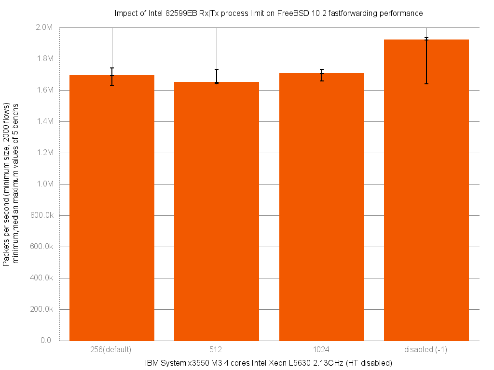

Impact of Intel 82599EB Rx|Tx process limit on forwarding performance
  - IBM System x3550 M3 with quad cores (Intel Xeon L5630 2.13GHz, hyper-threading disabled)
  - Dual port Intel 82599EB 10-Gigabit and OPT SFP (SFP-10G-LR)
  - FreeBSD 10.2
  - 2000 flows of smallest UDP packets
  - Traffic load at 14.48Mpps (10Gigabit line-rate)




```
x pps.256_default
+ pps.512
* pps.1024
% pps.disabled
+--------------------------------------------------------------------------+
|x %++ *    x ** *    * x                          %         %% %          |
|     |_______MA________|                                                  |
| |__M____A_______|                                                        |
|         |____A_M___|                                                     |
|                      |________________________A____________M____________||
+--------------------------------------------------------------------------+
    N           Min           Max        Median           Avg        Stddev
x   5       1628703       1742077       1692863     1695607.2     44736.296
+   5       1644324       1732816       1649351     1673037.2     39459.092
No difference proven at 95.0% confidence
*   5       1656996       1733063       1704109     1699062.6     27344.207
No difference proven at 95.0% confidence
%   5       1638967       1934694       1918842     1858668.2     125064.41
Difference at 95.0% confidence
	163061 +/- 136979
	9.61667% +/- 8.07846%
	(Student's t, pooled s = 93921.4)
```
