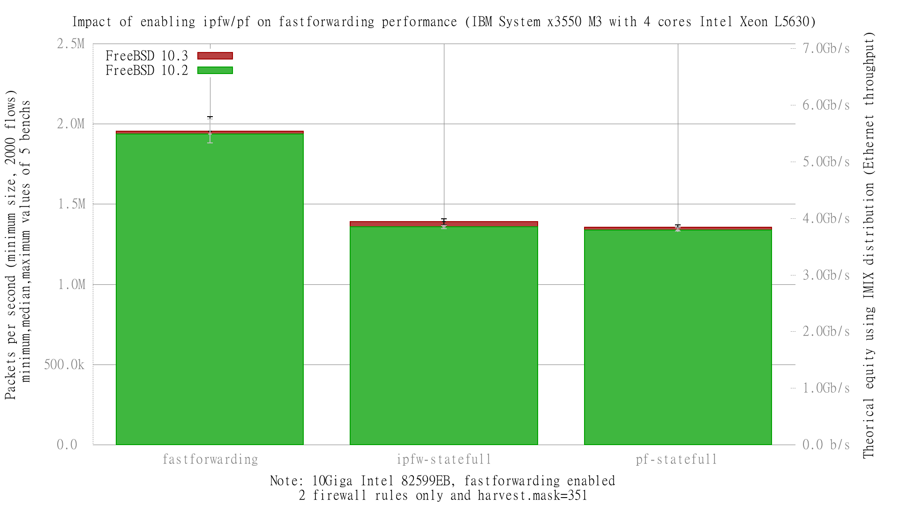

Impact of enabling ipfw or pf on fastforwarding performance
  - IBM System x3550 M3 with quad cores (Intel Xeon L5630 2.13GHz, hyper-threading disabled)
  - Dual port Intel 82599EB 10-Gigabit and OPT SFP (SFP-10G-LR)
  - FreeBSD 10.3
  - 2000 flows of smallest UDP packets
  - 2 firewall rules, 2 static routes
  - harvest.mask=351
  - Traffic load at 14.48Mpps (10Gigabit line-rate)




```
x pps.fastforwarding
+ pps.ipfw-statefull
* pps.pf-statefull
+--------------------------------------------------------------------------+
|     *  +                                                                 |
|    **  +                                                       x         |
|    **  + +                                                  x  x         |
|*   ****+++                                                  x xxxxx     x|
|                                                             |__MA__|     |
|       |A_|                                                               |
|   |AM|                                                                   |
+--------------------------------------------------------------------------+
    N           Min           Max        Median           Avg        Stddev
x  10     1919362.5       2045534       1955145       1962055      35832.64
+  10     1370393.5       1409094     1390302.5     1389812.6     12556.593
Difference at 95.0% confidence
        -572242 +/- 25226.4
        -29.1655% +/- 1.28571%
        (Student's t, pooled s = 26848.1)
*  10       1304712       1370953     1354804.5     1349375.9     17912.505
Difference at 95.0% confidence
        -612679 +/- 26615.9
        -31.2264% +/- 1.35653%
        (Student's t, pooled s = 28327)
```
