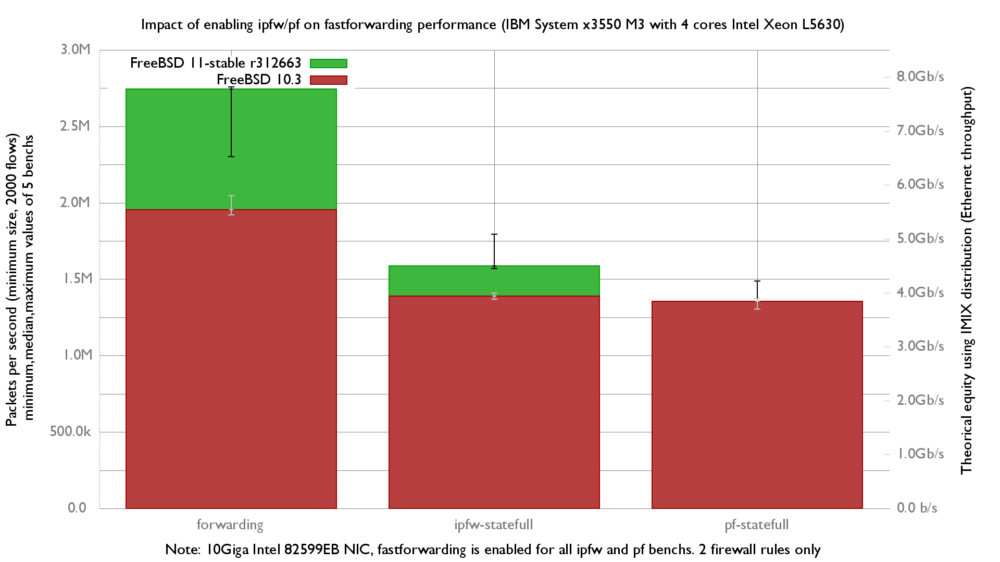

ipfw/pf impact on forwarding performance:
  - IBM System x3550 M3 with quad cores (Intel Xeon L5630 2.13GHz, hyper-threading disabled)
  - Dual port Intel 82599EB 10-Gigabit and OPT SFP (SFP-10G-LR)
  - FreeBSD 11-stable r312663
  - 2000 flows of smallest UDP packets
  - 2 firewall rules, 2 static routes
  - harvest.mask=351
  - Traffic load at 14.48Mpps (10Gigabit line-rate)

