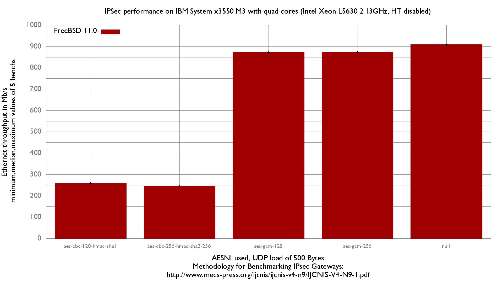

IPsec performance
  - IBM System x3550 M3 with quad cores (Intel Xeon L5630 2.13GHz, hyper-threading disabled)
  - Quad port Intel 82580 
  - harvest.mask=351
  - 2000 flows of UDP packets, multiplexed in one IPsec flow
  - 500B UDP load => packet size: 528B => Ethernet frame size:542B
  - Methodology: http://www.mecs-press.org/ijcnis/ijcnis-v4-n9/IJCNIS-V4-N9-1.pdf

