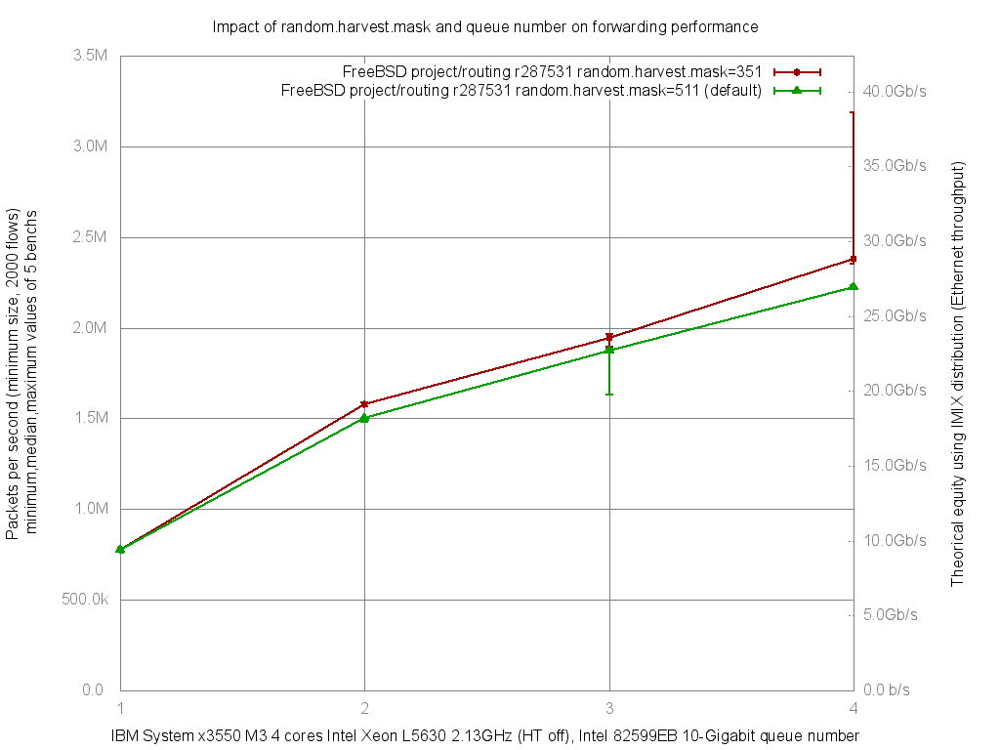

Impact of random.harvest.mask and Intel 82599EB queue number on forwarding performance
  - IBM System x3550 M3 with quad cores (Intel Xeon L5630 2.13GHz, hyper-threading disabled)
  - Dual port Intel 82599EB 10-Gigabit and OPT SFP (SFP-10G-LR)
  - FreeBSD 11-routing.r287531
  - 2000 flows of smallest UDP packets
  - Traffic load at 14.48Mpps (10Gigabit line-rate)




```
x pps.1
+ pps.2
* pps.3
% pps.4
+--------------------------------------------------------------------------+
|x                       +          **           %                         |
|x                       ++        ***           %%                    %  %|
|A                                                                         |
|                        A|                                                |
|                                  |A|                                     |
|                                             |___M________A___________|   |
+--------------------------------------------------------------------------+
    N           Min           Max        Median           Avg        Stddev
x   5        773301        782449        777039      777463.2     4119.0835
+   5       1566167       1589318       1578171     1578723.2     8405.6077
Difference at 95.0% confidence
	801260 +/- 9653.36
	103.061% +/- 1.24165%
	(Student's t, pooled s = 6618.95)
*   5       1895563       1965467       1944766     1938964.4     27013.927
Difference at 95.0% confidence
	1.1615e+06 +/- 28180.8
	149.396% +/- 3.62471%
	(Student's t, pooled s = 19322.5)
%   5       2354699       3187572       2380275       2675711     419471.22
Difference at 95.0% confidence
	1.89825e+06 +/- 432611
	244.159% +/- 55.6439%
	(Student's t, pooled s = 296625)
```
