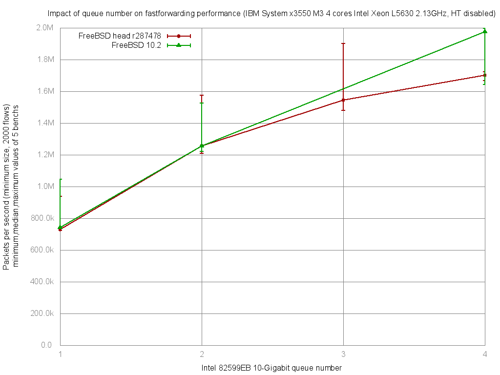

Impact of Intel 82599EB queue number on forwarding performance
  - IBM System x3550 M3 with quad cores (Intel Xeon L5630 2.13GHz, hyper-threading disabled)
  - Dual port Intel 82599EB 10-Gigabit and OPT SFP (SFP-10G-LR)
  - FreeBSD 11-head.r287478
  - 2000 flows of smallest UDP packets
  - Traffic load at 14.48Mpps (10Gigabit line-rate)




```
x pps.1
+ pps.2
* pps.3
% pps.4
+--------------------------------------------------------------------------+
|                                                    *         %           |
|   x            x               ++++            *  ** +    %%%%          *|
||__M__A____|                                                              |
|                             |____M___A________|                          |
|                                             |______M__A_________|        |
|                                                            |A|           |
+--------------------------------------------------------------------------+
    N           Min           Max        Median           Avg        Stddev
x   5        721927        937844        728896      769418.6     94204.351
+   5       1210309       1575707       1254681     1306485.4     151942.45
Difference at 95.0% confidence
        537067 +/- 184367
        69.8016% +/- 23.9619%
        (Student's t, pooled s = 126414)
*   5       1481160       1901401       1544350     1603129.6     169023.29
Difference at 95.0% confidence
        833711 +/- 199555
        108.356% +/- 25.9358%
        (Student's t, pooled s = 136827)
%   5       1666547       1722996       1701292     1699393.2     24440.828
Difference at 95.0% confidence
        929975 +/- 100367
        120.867% +/- 13.0445%
        (Student's t, pooled s = 68817.9)

```
